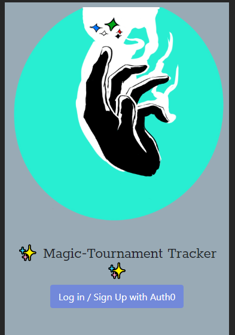
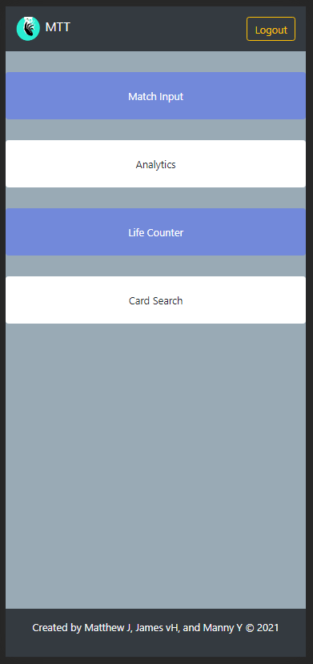
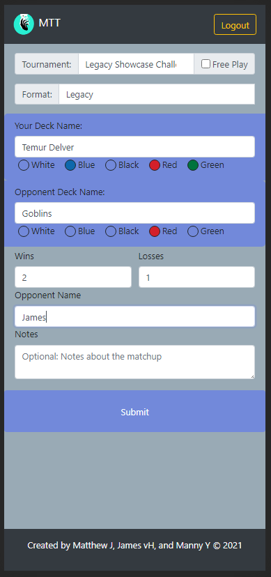
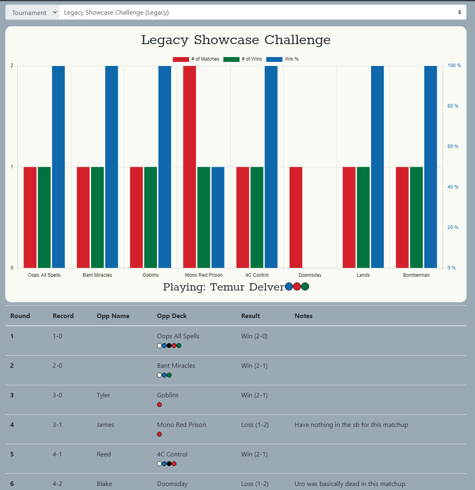
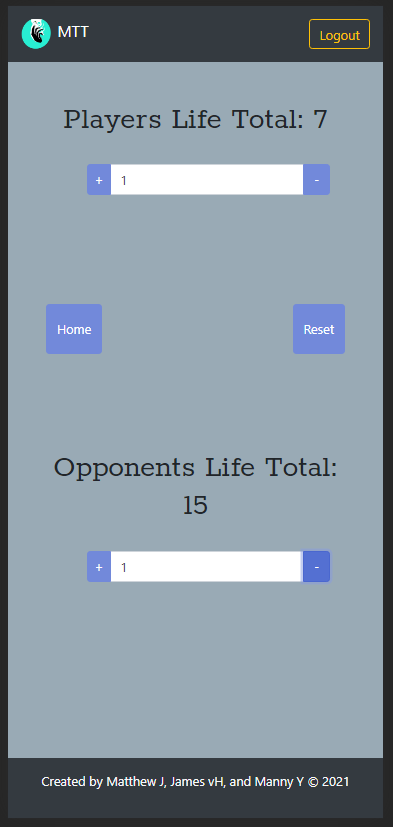
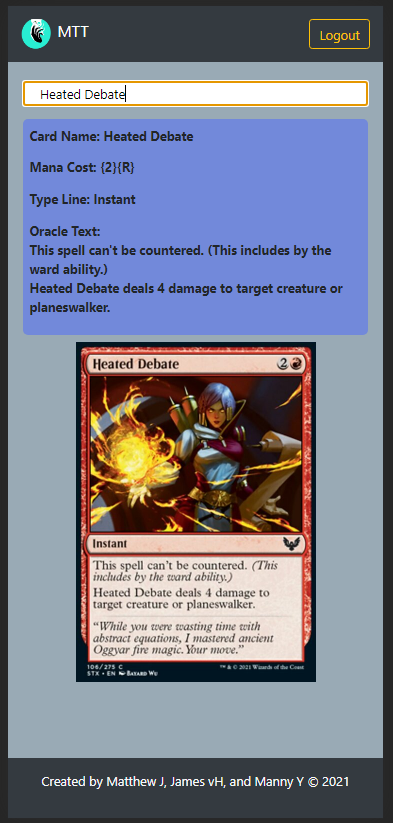

# Magic Tournament Tracker

Magic Tournament Tracker is an app for competitive Magic the Gathering players that allows them to easily log match results from tournaments and create visual representations of their win rates versus different matchups.  
The app also includes some utilities for use during gameplay such as a life counter and card search feature.

## [Deployed Application ](https://magic-tournament-tracker.herokuapp.com/)

<a href="google.com">link</a>

This app is deployed with Heroku here: https://magic-tournament-tracker.herokuapp.com/

## Functionality 

Upon navigating to the webpage the User with be asked to log in using Auth0. Magic Tournament Tracker does not store user passwords.

Once the user has logged in they will come to the Menu Page.

From here the user can select on Match Input to submit new data. Either choosing one of their existing tournaments from the drop down menu or entering a new tournament. Likewise, decks the user has previously played will be available as drop down options in the deck card. 

If the user selects on the Analytics option from the menu, they will be shown a graphical representation of their data. Here users can choose to display a specific tournament's data, a specific deck's data across all tournament, or their results across an entire format.

The life counter page displays the life totals for the two players in a game. Here the user can increment or decrement the two life totals and can change the amount the life total will be altered by.

The card search page allows user to type in a card name and the card image along with its text will be displayed on the screen.

## Future Development

In the future we are planning to add offline functionality to the website, allowing users who have downloaded the website as a PWA to submit match data while offline. 
We are also looking to implement the ability to update/fix mistakes with input matches as well as give the user the ability to delete their decks, tournaments, or matches. 

## Creators 

This app was created by [Matthew Johnson](https://github.com/MatthewRonaldJohnson), [James van Hoke](https://github.com/JamesvanHoke), and [Manny Ybarra](https://github.com/mybarra06)
