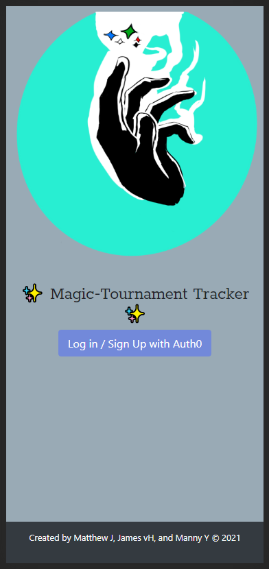
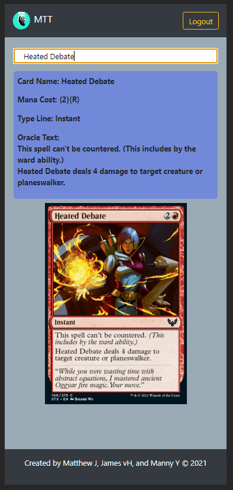

# Magic Tournament Tracker

Magic Tournament Tracker is an app for competitive Magic the Gathering players that allows them to easily log match results from tournaments and create visual repersentations of their winrates verus different matchups.  
The app also includes some utilities for use during gameplay. Currently just a card search feature, allowing users to quickly get the oracle of a card. 

## [Deployed Application ](https://magic-tournament-tracker.herokuapp.com/)

This app is deployed with heroku here: https://magic-tournament-tracker.herokuapp.com/

## Functioanlity 

Upon navigating to the webpage the User with be asked to log in using Auth0. Magic Tournament Tracker does not store user passwords itself. 

Once the user has logged in they will come to the Menu Page.

From here the user can select on Match Input to submit new data. Either choosing one of their exisiting tournaments from the drop down menu or entering a new tournament. Likewise, decks the user has previously played will be available as drop down options in the deck card. 

If the user selects on the Analytics option from the menu, they will be shown a graphical repersentation of their win rate data from the selected tournament. They can change which tournament's data is used to populate the chart with the drop down at the top of the page. 

The card search page allows user to type in a card name and the card image along with its text will be dispalyed on the screen.

## Future Development

We have many ideas to grow Magic Tournament Tracker in the future.  
Primarly we would like add the ability to generate graphical charts of win rates with a specific deck across all tournaments.  
We wish to turn this into a PWA so users could download the app onto their phone for easy use when at a tournament.  
We would like to integrate offline functionality to stash user data submissions and once the user reconnects transfer that over to the database.  
We want to add more gameplay utilities such as a life counter. 

## Creators 

This app was created by [Matthew Johnson](https://github.com/MatthewRonaldJohnson), [James van Hoke](https://github.com/JamesvanHoke), and [Manny Ybarra](https://github.com/mybarra06)